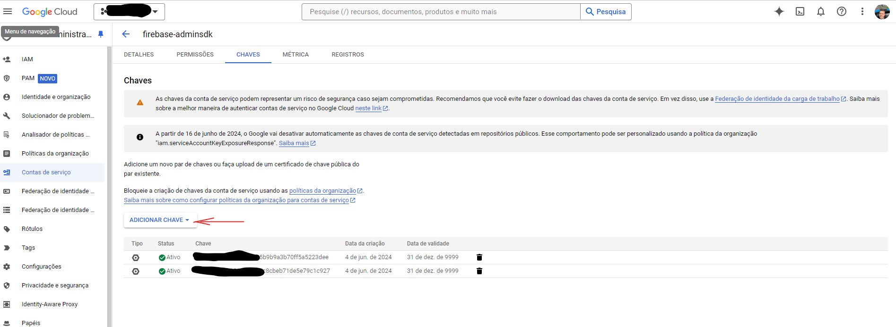
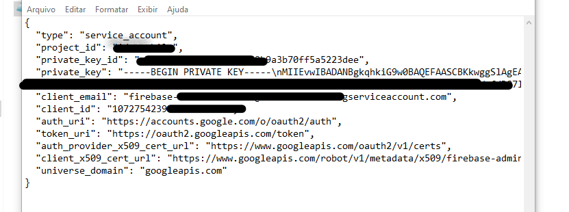

# rtoauth2
Project for get token oauth2, google api v1

Este repositório contém um componente de instalação Delphi que permite de forma prática fazer a conexão server to server com a Google Api v1.

## Atenção 
 - Validado somente no Delphi 11 até o momento
 - Exige dependências de terceiros citadas abaixo
 - Se houver alguma alteração do google api, possivelmente haverá reparos a serem feitos no componente

## Instalação de dependências necessárias
- [JOSE-JWT](https://github.com/paolo-rossi/delphi-jose-jwt/tree/master)

## Instalação 
- Coloque a pasta no seu local de preferência
- Abra o pacote e faça a instalação (clean, compile, install)
- Aponte a pasta src nas libraries do Delphi que desejar utilizar

## Como Usar (Exemplo na pasta Demo)
- Criar o objeto
- Alimentar o objeto
- Alimente local da sua chave, e o escopo da api que deseja acessar, para consultar os escopos acesse [Escopos Api Google](https://developers.google.com/identity/protocols/oauth2/scopes?hl=pt-br)
- Buscar o token
- Liberar o objeto
  
## Configuração no Google (Buscar chave)
- Documentação base usada para criação do componente [Documentation](https://developers.google.com/identity/protocols/oauth2/service-account)
- Primeiro acesse o [Console Google Cloud](https://console.cloud.google.com/?hl=pt-br)
- Na aba a seguir crie sua chave json, como na imagem
  
- Sua chave deverá se parecer com a imagem abaixo
  

 ##Obrigado e bom trabalho!

# English
Project for obtaining OAuth2 token, Google API v1

This repository contains a Delphi installation component that allows a practical server-to-server connection with Google API v1.

## Attention
- Validated only on Delphi 11 so far
- Requires third-party dependencies listed below
- If there is any change in the Google API, repairs may need to be made to the component

## Installation of necessary dependencies
- [JOSE-JWT](https://github.com/paolo-rossi/delphi-jose-jwt/tree/master)

## Installation
- Place the folder in your preferred location
- Open the package and install it (clean, compile, install)
- Point the src folder in the Delphi libraries you want to use

## How to Use (Example in the Demo folder)
- Create the object
- Feed the object
- Set the location of your key and the scope of the API you want to access. To consult the scopes, visit Google API Scopes [Escopos Api Google](https://developers.google.com/identity/protocols/oauth2/scopes?hl=pt-br)
- Fetch the token
- Release the object

## Configuration in Google (Get the key)
- Base documentation for component create [Documentation](https://developers.google.com/identity/protocols/oauth2/service-account)
- First, access the Google Cloud Console
- In the following tab, create your JSON key, as shown in the image

- Your key should look like the image below
  

  ##Thanks, good working

  
